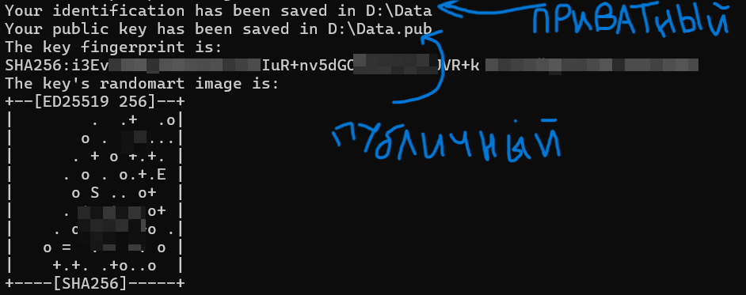
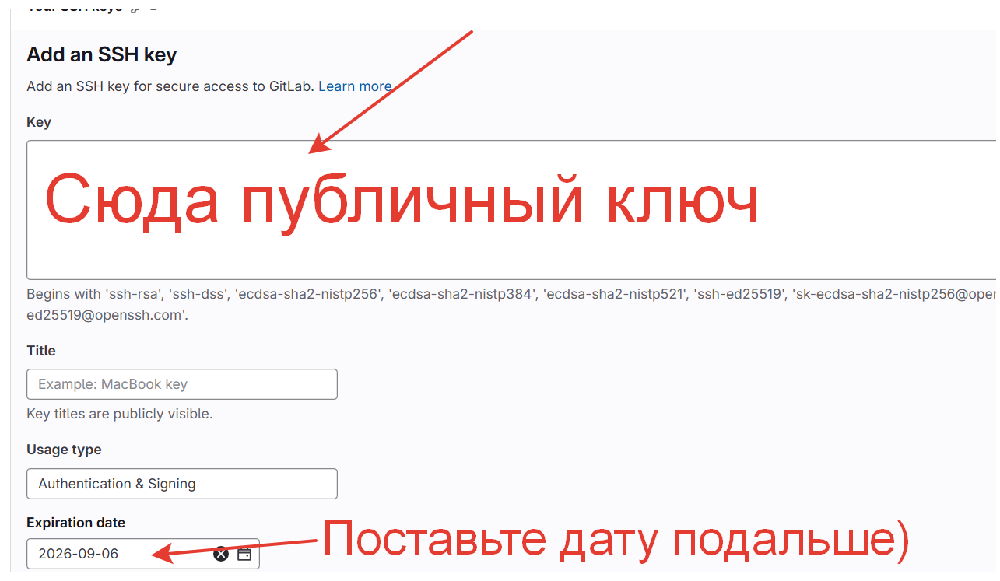
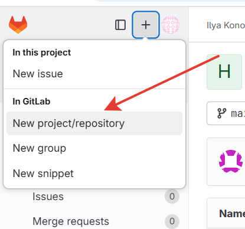

# Курс Инструменты разработчика.
## Знакомство с Git

__Git__ - распределённая система контроля версий для отслеживания изменений в файлах.

## 1. Установка

Первым делом необходимо [установить](https://git-scm.com/downloads) **Git** на компьютер.

## 2. Создание ssh ключа

**SSH (Secure SHell)** - это сетевой протокол, посредством которого два компьютера могут взаимодействовать и обмениваться данными. Важно, что данные при этом шифруются, поэтому протокол ssh считается безопасным.

Для этого открываем терминал (Для ***Windows*** - командная строка) на устройстве и вводим команду:
```bash
> in
ssh-keygen
```
Далее предложит сохранить пару ключей ssh по дефолтному пути (нажать **ENTER**), либо самому можно ввести необходимый путь.:
```bash
< out
Generating public/private ed25519 key pair.
Enter file in which to save the key (C:\<any_path>/.ssh/id_ed25519):
```
После предложит ввести пароль для пары, но в этом сейчас нет необходимости. Просто дважды нажмите **ENTER**:
```bash
< out
Enter passphrase (empty for no passphrase): <ENTER>
Enter same passphrase again: <ENTER>
```
После этого выведется путь, куда сохранился приватный и публичный ключ (.pub). Приватный пока не нужен, надо открыть файл с публичным ключом и скопировать его для следующего шага.


## 3. Добавление ssh-ключа в Gitlab

Заходим на сайт [Gitlab](https://mipt-hsse.gitlab.yandexcloud.net/) и следуем по стрелочкам.



И сохраняем ключ.

## 4. Работа с Git
Запускаем Git. Для Windows открываем Git Bash, Для Linux открываем консоль.
Теперь склонируем преподавательский репозиторий с помощью:
```bash
git clone git@mipt-hsse.gitlab.yandexcloud.net:pro100savant/hellow_word_2025.git
```
Строчка `git@mipt-hsse.gitlab.yandexcloud.net:pro100savant/hellow_word_2025.git` взята отсюда:

И создадим свой репозиторий.



Затем склонируем свой репозиторий точно так же, как и клонировали преподавательский до этого. И скопируем все файлы из преподавательской папки в свою (просто CTRL + C, CTRL + V).
Теперь перейдем в консоли в папку со своим репозиторием и введем команду:
```bash
git status
```
Если не выдает ошибки, значит всё ОК!
Теперь выполним пробное задание, записав ФИО в файлик нужный.

И проделаем следующие шаги:
```bash
git add .
```
Это команда обновляет изменения из рабочего каталога в индекс — промежуточную область между рабочей директорией и репозиторием. Это подготавливает файлы для следующего коммита.

```bash
git commit -m "Add my name"
```
Эта команда для создания коммита с сообщением о них. Флаг -m (от «message») позволяет задать сообщение коммита 
И последнее!
```bash
git push
```
Отправляем все изменения в Gitlab ✨

Все вопросы можно писать сюда ---> [@lokisf8](https://t.me/lokisf8)
